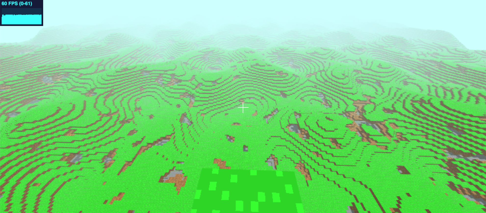

# Blockland

A Minecraft clone in the browser!

## Overview

Blockland is a browser-based voxel engine made with ClojureScript, WebGL, WebAssembly, and a Web Worker.

## About Blockland

#### Blockland uses a physics engine.

I chose the Bullet physics engine because it allows for objects of arbitrary shapes (like chunks in a voxel engine) with good performance. Bullet is supported in the browser thanks to the wonderful [ammo.js](https://github.com/kripken/ammo.js) project.

#### Blockland uses [three.js](https://github.com/mrdoob/three.js).

three.js has great documentation.

## Development

You will need both [Emscripten](https://github.com/kripken/emscripten) and NPM.

To get an interactive development environment run:

    sh compile.sh
    npx shadow-cljs watch game

and open your browser at [localhost:8080](http://localhost:8080/).

## TODO

- Fix a bug where the player can place blocks they end up inside of
- Block selection

## Credits

Textures are from [https://github.com/deathcap/ProgrammerArt](https://github.com/deathcap/ProgrammerArt)

## License

Copyright 2019 Christopher Williams

Distributed under the Eclipse Public License version 1.0
